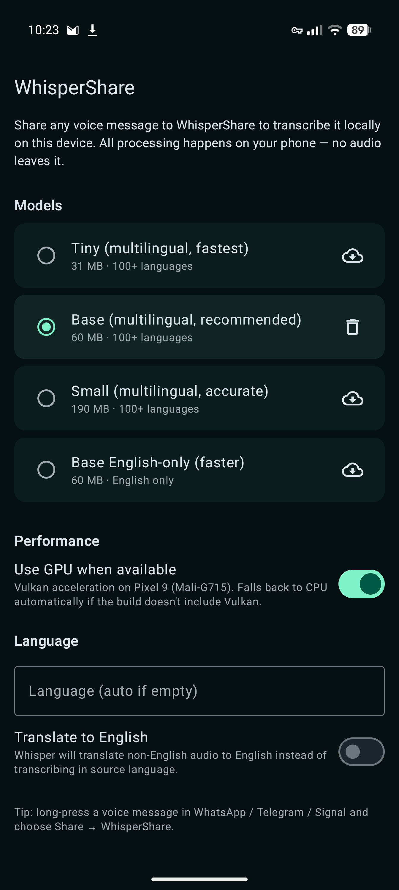
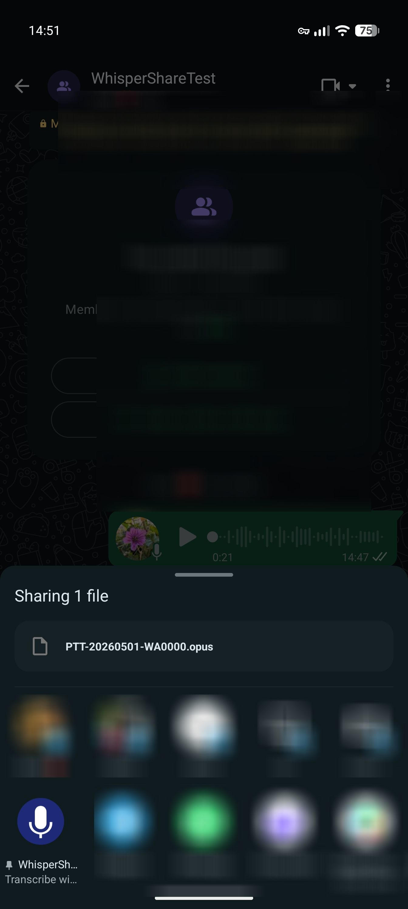
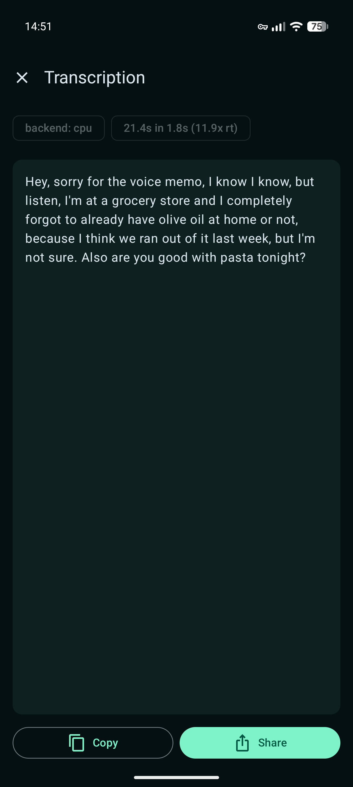

# WhisperShare

Android app that transcribes voice messages on-device with whisper.cpp, wired
into the share sheet. Tested mostly on a Pixel 9.

- **Local only.** Audio never leaves the phone.
- **Share to transcribe.** Long-press a voice note in WhatsApp / Telegram / Signal,
  Share, pick WhisperShare.
- **GPU path** via Vulkan (Mali-G715). CPU is fast enough on small/base that I
  rarely flip it on.
- **Multilingual.** German, English, etc., or auto-detect. Optional translate-to-English.

<p align="center">
  
  
  
</p>

---

## Privacy

Audio never leaves your device. The only network call is the opt-in model
download from `huggingface.co` when you tap the cloud icon. No analytics, no
crash reporters, no third-party SDKs. `INTERNET` is the only permission.

Full policy: <https://daniilbabanin.github.io/WhisperShare/privacy/>

---

## Install

- **GitHub release.** Sideload `WhisperShare.apk` from the
  [latest release](https://github.com/DaniilBabanin/WhisperShare/releases/latest).
- **Obtainium.** Add `https://github.com/DaniilBabanin/WhisperShare` as a source.

arm64-v8a, Android 12+.

Every release is signed in GitHub Actions with the same key. Signing
certificate SHA-256 (pin it in Obtainium to verify updates):

```
1601abb6092cc3cc58ee2237995eabc60c59688d107caabb36a4a7e6bf8b1251
```

The signing key is committed to this repository, so the signature proves
reproducibility ("built from this repo"), not origin — only install releases
from this GitHub repository.

---

## Usage

1. Launch once. Tap the cloud icon next to **Base (multilingual)** to download
   the default model (~60 MB), then select it.
2. In WhatsApp/Telegram/Signal, long-press a voice message and share to WhisperShare.
3. Text appears with **Copy** / **Share** buttons.

Settings:

- **Use GPU when available.** Only does anything if you built with `whispershare.vulkan=true`.
- **Language.** Empty for auto-detect, or `de` / `en` / `fr` etc.
- **Translate to English.** German/Russian/etc. audio comes out as English text.

---

## Build it

Android Studio Ladybug (2024.2)+ with NDK side-by-side.

```bash
git clone git@github.com:DaniilBabanin/WhisperShare.git
cd WhisperShare
# Android Studio will prompt for: SDK 35, NDK 27.x, CMake 3.22.1.
# For Vulkan: set whispershare.vulkan=true in gradle.properties (+~3 MB APK).
```

CLI:

```bash
./gradlew assembleRelease   # app/build/outputs/apk/release/app-release-unsigned.apk
./gradlew installDebug      # debug build straight to device
```

---

## Models

From `huggingface.co/ggerganov/whisper.cpp`:

| Model | Size | Speed on Pixel 9 (CPU) | Quality |
|-------|------|------------------------|---------|
| `tiny-q5_1` | 31 MB | ~15× realtime | OK for clear English |
| `base-q5_1` | 60 MB | ~8× realtime | **Recommended default** |
| `small-q5_1` | 190 MB | ~3× realtime | Best for accents / noise / mixed languages |
| `base.en-q5_1` | 60 MB | ~10× realtime | English-only, slightly faster than `base-q5_1` |

For German, use `base-q5_1` or `small-q5_1`. With Vulkan, `small` runs ~1.5–2×
faster than CPU; on tiny/base, dispatch overhead eats the win.

---

## How it works

```
[Share intent] ─▶ TranscribeActivity
                     │
                     ▼
        AudioDecoder (MediaCodec)
        decodes OPUS/AAC/MP3 → PCM 16 kHz mono float
                     │
                     ▼
        WhisperEngine (JNI → whisper.cpp)
        runs whisper_full() in a coroutine
                     │
                     ▼
              TranscribeScreen
              (selectable text + Copy/Share)
```

`libwhispershare.so` is built by CMake during gradle sync. `FetchContent` pulls
whisper.cpp v1.7.4 the first time.

---

## Project layout

```
app/
├── build.gradle.kts          # NDK ABIs (arm64-v8a only), Compose, CMake glue
├── CMakeLists.txt            # Fetches whisper.cpp, builds JNI .so
├── src/main/
│   ├── AndroidManifest.xml   # Share intent filters
│   ├── cpp/whisper_jni.cpp   # JNI bridge to whisper_full()
│   ├── kotlin/io/whispershare/
│   │   ├── WhisperApp.kt
│   │   ├── WhisperEngine.kt  # Kotlin wrapper of JNI calls
│   │   ├── AudioDecoder.kt   # MediaCodec → 16 kHz float PCM
│   │   ├── ModelManager.kt   # Download & list ggml models
│   │   ├── AppPreferences.kt
│   │   ├── MainActivity.kt   # Home / settings
│   │   ├── TranscribeActivity.kt   # Share-target activity
│   │   ├── ShareUtils.kt
│   │   └── ui/               # Compose screens + theme
│   └── res/                  # Strings, themes, launcher icon
└── proguard-rules.pro
```

---

## Maybe later

- Cache transcriptions in Room (currently they vanish on close).
- Foreground service for files >5 min.
- VAD pre-trimming with `ggml-silero-vad`.
- Notification with the text so the app doesn't need to stay foregrounded.
- Translate to languages other than English.

---

## Caveats

- **First fresh build is slow.** whisper.cpp gets cloned and compiled for arm64.
  Incremental builds are quick.
- **Vulkan on Mali can crash** on very old quantizations. Set
  `whispershare.vulkan=false` and rebuild if it does.

---

## License
MIT
